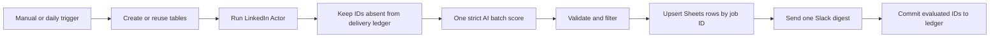

# LinkedIn Job Match Digest

Runs `fetch_cat/linkedin-jobs-scraper` for the newest jobs from the past 24
hours, checks a durable delivery ledger, scores all new jobs in one strict
structured AI call, upserts qualified jobs to
Google Sheets, and sends one Slack digest containing the top five.

The workflow has a manual trigger and a daily 08:00 trigger. It is deliberately
inactive on import.

## Setup

1. Import `workflow.json` into n8n Cloud or self-hosted n8n.
2. Create an HTTP Header Auth credential for Apify. Set the header name to
   `Authorization` and the value to `Bearer YOUR_APIFY_TOKEN`, then select it in
   `Fetch LinkedIn Jobs from Apify`.
3. Add an OpenAI credential to the scoring node.
4. Create a spreadsheet with a `Jobs`
   tab and these headers: `title`, `company`, `location`, `postedAt`,
   `jobLink`, `score`, `reason`, `collectedAt`, `linkedInJobId`. Format
   both `postedAt` and `collectedAt` as Date time in Google Sheets.
5. Add Google Sheets credentials and select that spreadsheet and tab in
   `Upsert Qualified Jobs`.
6. Create or select a Slack channel, connect Slack, and
   select it in `Send Slack Digest`.
7. Run `LinkedIn Setup Form` once and save the search and candidate profile.
   The workflow creates both required Data Tables automatically. If the form is
   skipped, the first normal run creates safe default configuration.
8. Optionally import `../shared-error-notifications/workflow.json` and select it as this
   workflow's error workflow.

The generated `FetchCat LinkedIn Config` row can also be edited directly in
n8n Data Tables after setup.

The submitted workflow uses only Cloud-compatible n8n nodes. On a self-hosted
instance, you may optionally replace the HTTP Request node with
`@apify/n8n-nodes-apify`, but this is not required.

No credential ID is stored in this repository. Selecting credentials changes
only the private instance copy.

## Behavior

- Actor input is fixed to `past24h`, newest first, and at most 10 jobs.
- Descriptions are capped before they reach OpenAI.
- Known LinkedIn navigation labels are discarded before scoring.
- Batch validation fails closed unless OpenAI returns exactly one unique result
  for every supplied job ID.
- IDs are committed only after Sheets and Slack finish successfully. A failed
  destination remains retryable; Sheets upsert prevents duplicate rows.
- Posted-relative text is converted to a sortable estimated Sheets date-time
  using the Actor's collection timestamp. Collection time is also stored as a
  true date-time value.
- `jobLink` displays a compact `Open job` hyperlink. `linkedInJobId` is the
  stable LinkedIn job ID used for cross-execution deduplication.
- Fit reasons are always returned in English, even for non-English listings.
- A delivered duplicate or empty run creates no rows and sends no Slack message.

## QA

Use no more than three Apify-backed runs: a happy path, an immediate duplicate
rerun, and one negative/empty query. Confirm the second run adds zero rows and
sends zero messages. Export, sanitize, reimport, and execute the reimport before
marking the workflow `qa-passed`.

Synthetic Actor output and assertions are under `fixtures/`; they contain no
real jobs or personal data.
