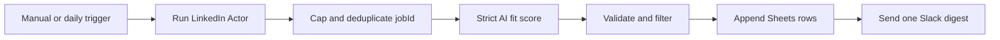

# LinkedIn Job Match Digest

Runs the FetchCat LinkedIn Jobs Scraper for the newest jobs from the past 24
hours, removes jobs seen in earlier executions, scores each new job against a
candidate profile with strict structured output, appends qualified jobs to
Google Sheets, and sends one Slack digest containing the top five.

The workflow has a manual trigger and a daily 08:00 trigger. It is deliberately
inactive on import.

## Setup

1. Install `@apify/n8n-nodes-apify@0.6.10` and import `workflow.json`.
2. Add Apify and OpenAI credentials to the two processing nodes.
3. Create a spreadsheet named `FetchCat n8n QA - LinkedIn Jobs` with a `Jobs`
   tab and these headers: `jobId`, `title`, `company`, `location`, `posted`,
   `url`, `score`, `reason`, `scrapedAt`.
4. Add Google Sheets credentials and select that spreadsheet and tab in
   `Append Qualified Jobs`.
5. Create or select the `fetchcat-n8n-qa` Slack channel, connect Slack, and
   select it in `Send Slack Digest`.
6. Edit the `Configuration` code node with the candidate's keywords, location,
   profile, and minimum score.

No credential ID is stored in this repository. Selecting credentials changes
only the private instance copy.

## Behavior

- Actor input is fixed to `past24h`, newest first, and at most 10 jobs.
- Descriptions are capped before they reach OpenAI.
- `Remove Duplicates` retains up to 10,000 `jobId` values across executions.
- Invalid AI output stops the workflow before Google Sheets or Slack.
- A duplicate, empty, or below-threshold run creates no rows and sends no Slack
  message.

## QA

Use no more than three Apify-backed runs: a happy path, an immediate duplicate
rerun, and one negative/empty query. Confirm the second run adds zero rows and
sends zero messages. Export, sanitize, reimport, and execute the reimport before
marking the workflow `qa-passed`.

Synthetic Actor output and assertions are under `fixtures/`; they contain no
real jobs or personal data.

