# LinkedIn Job Match Digest

Runs the [FetchCat LinkedIn Jobs Scraper](https://apify.com/fetch_cat/linkedin-jobs-scraper)
(`fetch_cat/linkedin-jobs-scraper`) for jobs posted in the past 24 hours,
checks a durable delivery ledger, and scores all new jobs in one strict AI
batch. Qualified matches are saved to Google Sheets, then the five strongest
matches are sent in one Slack digest.

The workflow has a manual trigger and a daily noon trigger. It is inactive on
import and works on n8n Cloud and self-hosted n8n.

The canvas follows n8n's template annotation standard: one yellow overview
with setup checkboxes and seven white notes surrounding the logical node groups.

## Setup

1. Import `workflow.json`.
2. Open `1. Set Your Job Search` and change `keywords`, `location`,
   `candidateProfile`, `minimumScore`, and `maxItems`.
3. Open the [FetchCat LinkedIn Jobs Scraper](https://apify.com/fetch_cat/linkedin-jobs-scraper)
   and add it to your Apify account if required. Create an HTTP Header Auth credential whose header is
   `Authorization` and value is `Bearer YOUR_APIFY_TOKEN`. Select it in
   `2. Find Recent LinkedIn Jobs`.
4. Connect OpenAI to `3. Score Jobs Against Your Profile`.
5. Create a Google Sheet with a `Jobs` tab containing `Job title`, `Company`,
   `Location`, `Posted at`, `Job`, `Match score`, `Why it matches`, `Added at`,
   and `LinkedIn job ID`, then select it in `4. Save Matches to Google Sheets`.
6. Connect Slack and select the digest channel in `5. Send Top Matches to Slack`.
7. Optionally import `../shared-error-notifications/workflow.json` and select it
   as this workflow's error workflow.

The workflow creates `FetchCat Delivery Ledger` automatically. No setup form or
configuration table is required. A self-hosted user may optionally replace the
HTTP Request node with `@apify/n8n-nodes-apify`, but this is not necessary.

## Behavior

```mermaid
flowchart LR
  T[Manual or noon trigger] --> L[Create or reuse ledger]
  L --> C[1. Set Your Job Search]
  C --> A[Run FetchCat LinkedIn Jobs Scraper]
  A --> D[Skip delivered job IDs]
  D --> O[One strict AI batch score]
  O --> F[Validate and filter]
  F --> S[Upsert qualified jobs to Sheets]
  S --> X[Send one Slack digest]
  X --> K[Commit evaluated IDs]
```

- Actor input is fixed to `past24h`, newest first, and at most 10 jobs.
- Descriptions are capped before OpenAI processing.
- Batch validation fails closed unless OpenAI returns exactly one result for
  every supplied LinkedIn job ID.
- Google Sheets is updated before Slack. IDs are committed only after both
  destinations succeed, so a failed delivery remains retryable.
- Google Sheets receives sortable date-time values and compact `Open job`
  hyperlinks. Slack receives one digest containing the five strongest matches.
- Fit reasons are always returned in English.
- Duplicate, empty, or fully unqualified runs create no destination writes.

## QA

Use no more than three Apify-backed runs: happy, duplicate, and negative. Test
the delivery path with synthetic payloads without starting extra Actor runs.
Export, sanitize, reimport, and confirm the reimport remains inactive.

Synthetic Actor output and assertions are under `fixtures/`; they contain no
real jobs or personal data.
