# LinkedIn Job Match Digest

Runs `fetch_cat/linkedin-jobs-scraper` for jobs posted in the past 24 hours,
checks a durable delivery ledger, and scores all new jobs in one strict AI
batch. Qualified matches go to one selected destination: Slack, Gmail,
Telegram, Google Sheets, or Notion.

The workflow has a manual trigger and a daily noon trigger. It is inactive on
import and works on n8n Cloud and self-hosted n8n.

## Setup

1. Import `workflow.json`.
2. Open `Edit Search Settings` and change `keywords`, `location`,
   `candidateProfile`, `minimumScore`, and `maxItems`.
3. Set `deliveryDestination` to exactly one of `slack`, `gmail`, `telegram`,
   `googleSheets`, or `notion`.
4. For Apify, create an HTTP Header Auth credential whose header is
   `Authorization` and value is `Bearer YOUR_APIFY_TOKEN`. Select it in
   `Fetch LinkedIn Jobs from Apify`.
5. Connect OpenAI to `Score Job Batch`.
6. Configure only the selected destination node and credential. For Gmail, set
   `gmailRecipient`; for Telegram, set `telegramChatId` in the settings node.
7. For Google Sheets, create a `Jobs` tab with `title`, `company`, `location`,
   `postedAt`, `jobLink`, `score`, `reason`, `collectedAt`, and
   `linkedInJobId`, then select it in `Upsert Qualified Jobs`.
8. Optionally import `../shared-error-notifications/workflow.json` and select it
   as this workflow's error workflow.

The workflow creates `FetchCat Delivery Ledger` automatically. No setup form or
configuration table is required. A self-hosted user may optionally replace the
HTTP Request node with `@apify/n8n-nodes-apify`, but this is not necessary.

## Behavior

```mermaid
flowchart LR
  T[Manual or noon trigger] --> L[Create or reuse ledger]
  L --> C[Edit Search Settings]
  C --> A[Run LinkedIn Actor]
  A --> D[Skip delivered job IDs]
  D --> O[One strict AI batch score]
  O --> F[Validate and filter]
  F --> R[Route to one destination]
  R --> X[Slack, Gmail, Telegram, Sheets, or Notion]
  X --> K[Commit evaluated IDs]
```

- Actor input is fixed to `past24h`, newest first, and at most 10 jobs.
- Descriptions are capped before OpenAI processing.
- Batch validation fails closed unless OpenAI returns exactly one result for
  every supplied LinkedIn job ID.
- Only the selected destination branch executes.
- IDs are committed only after the selected destination succeeds, so a failed
  delivery remains retryable.
- Google Sheets receives sortable date-time values and compact `Open job`
  hyperlinks. Notion receives one page per qualified job. Slack, Gmail, and
  Telegram receive one digest containing the five strongest matches.
- Fit reasons are always returned in English.
- Duplicate, empty, or fully unqualified runs create no destination writes.

## QA

Use no more than three Apify-backed runs: happy, duplicate, and negative. Test
each destination with synthetic payloads without starting extra Actor runs.
Export, sanitize, reimport, and confirm the reimport remains inactive.

Synthetic Actor output and assertions are under `fixtures/`; they contain no
real jobs or personal data.
