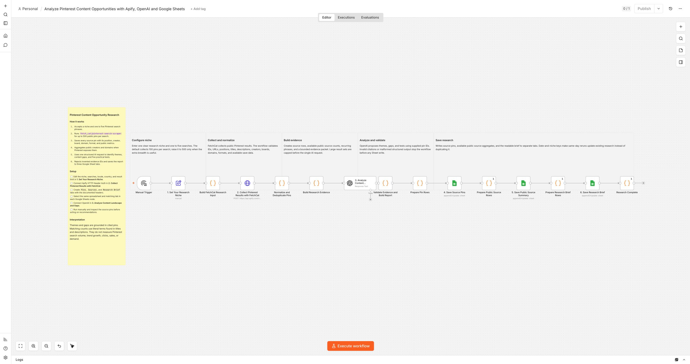

# Analyze Pinterest content opportunities with Apify, OpenAI and Google Sheets

Turn a Pinterest niche into inspectable content research instead of
another unstructured list of pins. This workflow runs
`fetch_cat/pinterest-search-scraper`, saves every source result, and produces an
evidence-linked research brief.

For example, enter `female cycling` and request up to 500 public results. The output
shows how many pins Pinterest returned, which formats and phrases recur, what the
existing results underrepresent, and five production-ready content briefs. Each brief
includes a proposed pin title, visual concept, audience problem, differentiating angle,
destination content, observed phrases, and unvalidated search-expansion ideas.

## Who is it for?

- Pinterest marketers researching a niche before publishing
- Bloggers and publishers planning evidence-backed content
- Ecommerce teams comparing visible content and destination sites
- Agencies creating repeatable client research

## How it works

1. Accepts one niche and one to five Pinterest search phrases.
2. Collects 20 to 500 public pins per search with FetchCat.
3. Saves positions, titles, descriptions, creators, boards, domains, destinations,
   formats, images, and available public metrics.
4. Builds a bounded evidence packet and analyzes it in one structured OpenAI call.
5. Removes invalid citations and rejects findings without supplied evidence.
6. Clearly separates observed phrases from unvalidated search-expansion ideas.
7. Saves source pins and the readable brief to separate Google Sheet tabs.

Public detail enrichment is enabled by default. Pinterest can still withhold creator,
board, domain, destination, save, or repin fields. Those fields remain on individual
pin rows when available and are left blank rather than inferred when unavailable.

## Required accounts

- Apify with access to `fetch_cat/pinterest-search-scraper`
- OpenAI
- Google Sheets

Only built-in n8n nodes are used, so the workflow runs on n8n Cloud and self-hosted
n8n. Same-day reruns update stable research keys. Findings describe only the supplied
Pinterest results and are not labeled as search volume, trend growth, clicks, sales,
or demand.
