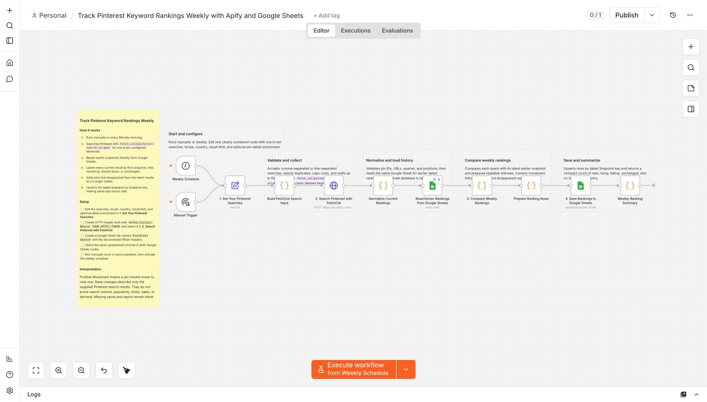

# Track Pinterest keyword rankings weekly with Apify and Google Sheets

Monitor where public pins appear for your Pinterest searches without manually
repeating the same research every week. This workflow runs
`fetch_cat/pinterest-search-scraper`, compares current positions with the latest
earlier snapshot, and keeps the complete dated history in Google Sheets.

## Who is it for?

- Pinterest marketers monitoring keyword visibility
- Bloggers and publishers researching search-result changes
- Ecommerce teams watching product and category searches
- Agencies maintaining repeatable client research

## How it works

1. Runs manually or every Monday morning.
2. Accepts one to ten Pinterest searches in one editable setup node.
3. Starts FetchCat Pinterest Search Scraper through the Apify API.
4. Waits up to five minutes for the Actor and validates every result before storage.
5. Reads the latest earlier rankings from the selected Google Sheet.
6. Labels pins as first snapshot, new, moved up, moved down, unchanged, or no longer visible.
7. Upserts the dated rows by Snapshot key, preventing duplicates on same-day reruns.
8. Returns a compact summary of the observed changes.

Set up the Sheet with the fifteen headers documented in the workflow overview,
freeze its first row, and format `Snapshot at` as **Date time**. The workflow stores
a native Sheets date-time value so snapshots remain sortable.

## Required accounts

- Apify with access to `fetch_cat/pinterest-search-scraper`
- Google Sheets

Only built-in n8n nodes are used, so the workflow runs on n8n Cloud and self-hosted
n8n. It does not require Pinterest login, OpenAI, Notion, community nodes, or a
separate database. Rank movement describes the configured search results only and is
not presented as Pinterest search volume or demand.
