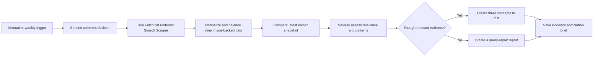

# Pinterest Visual Opportunity Decision Brief

Runs the [FetchCat Pinterest Search Scraper](https://apify.com/fetch_cat/pinterest-search-scraper)
(`fetch_cat/pinterest-search-scraper`) every week, visually assesses nine balanced
search results, rejects irrelevant meanings, and turns sufficient evidence into
three concrete product or content concepts. Weak searches produce a query-repair
report instead of generic ideas.

Google Sheets receives the sortable source evidence. Notion receives a decision
brief with evidence quality, query verdicts, observed visual patterns, concepts
to test, concepts to avoid, next actions, better searches, linked pins, and five
source images. The workflow works on n8n Cloud and self-hosted n8n without
community nodes.

## Setup

1. Import `workflow.json`.
2. Open `1. Set Your Pinterest Research` and edit every decision field together:
   research name, decision, offer, audience, brand style, constraints, and exactly
   three focused comma-separated queries. Avoid abbreviations and broad terms.
3. Open the [FetchCat Pinterest Search Scraper](https://apify.com/fetch_cat/pinterest-search-scraper)
   and add it to your Apify account if required. Create an HTTP Header Auth
   credential with header `Authorization` and value `Bearer YOUR_APIFY_TOKEN`.
   Select it in both FetchCat HTTP Request nodes.
4. Connect OpenAI to `3. Generate Weekly Content Brief`. The selected model must
   accept image inputs and structured JSON output.
5. Create a Google Sheet tab named `Pinterest Search` with these headers:
   `Snapshot at`, `Query`, `Position`, `Previous position`, `Movement`, `Status`,
   `Pin`, `Title`, `Creator`, `Domain`, `Image`, `Saves`, `Repins`,
   `Pinterest pin ID`, and `Snapshot key`. Select it in the Sheets node.
6. Connect Notion, share a database with the integration, and select it in
   `5. Create Pinterest Brief in Notion`.
7. Optionally import `../shared-error-notifications/workflow.json` and select it
   as this workflow's error workflow.

The workflow creates `FetchCat Pinterest Search Snapshots` automatically.

## Behavior

- Exactly three queries keep the evidence set coherent and make query-level
  quality visible.
- Nine pin images and their public metadata are assessed in one structured OpenAI
  call. Keyword overlap alone does not count as relevance.
- The default evidence gate requires six relevant pins. It can be set from five
  to eight.
- A passing run returns exactly three differentiated concepts with product or
  format, audience intent, design concept, visual direction, Pinterest copy,
  keywords, confidence, and linked supporting pins.
- A failing run returns zero concepts, explains which searches failed, and gives
  replacement queries and next actions.
- The first run is a baseline. Later runs compare observed position only; the
  workflow never invents demand, sales, search volume, clicks, or impressions.
- Same-day evidence rows are idempotent, and the Data Table snapshot is committed
  only after Sheets and Notion succeed.

## Output

The Notion report begins with `READY TO TEST` or `INSUFFICIENT EVIDENCE`. Evidence
and recommendations are separate. Five source images are embedded next to their
relevance decision, visual description, rejection reason where applicable, and
clickable Pinterest URL.

Pinterest search visibility is useful research evidence, but it is not proof of
commercial demand. Validate recommended concepts with marketplace, keyword, and
sales data before production.

## QA

Use no more than three Apify-backed runs: relevant happy path, same-day retry,
and deliberately ambiguous negative path. Confirm the negative run creates no
concepts, the retry creates no duplicate rows or pages, image blocks render, and
all cited URLs belong to supplied pins. Export, sanitize, reimport, and verify the
reimport remains inactive.
