# Pinterest Search Opportunities and Content Brief

Runs the [FetchCat Pinterest Search Scraper](https://apify.com/fetch_cat/pinterest-search-scraper)
(`fetch_cat/pinterest-search-scraper`) every week, records a dated Pinterest
search snapshot, compares it with the latest earlier snapshot, and creates an
evidence-grounded content opportunity brief.

Google Sheets receives the sortable source evidence. Notion receives a polished
brief with research criteria, an executive summary, observed changes or baseline
findings, search patterns, five content opportunities, and linked source pins.
The workflow has manual and weekly triggers, remains inactive on import, and
works on n8n Cloud and self-hosted n8n without community nodes.

## Setup

1. Import `workflow.json`.
2. Open `1. Set Your Pinterest Research` and edit the research name, business
   context, audience, comma-separated queries, locale, country, and result limit.
3. Open the [FetchCat Pinterest Search Scraper](https://apify.com/fetch_cat/pinterest-search-scraper)
   and add it to your Apify account if required. Create an HTTP Header Auth
   credential with header `Authorization` and value `Bearer YOUR_APIFY_TOKEN`.
   Select it in `2. Search Pinterest with FetchCat` and
   `Get Pinterest Search Results`.
4. Connect OpenAI to `3. Generate Weekly Content Brief`.
5. Create a Google Sheet tab named `Pinterest Search` with these headers:
   `Snapshot at`, `Query`, `Position`, `Previous position`, `Movement`, `Status`,
   `Pin`, `Title`, `Creator`, `Domain`, `Image`, `Saves`, `Repins`,
   `Pinterest pin ID`, and `Snapshot key`. Select it in
   `4. Save Pinterest Evidence to Google Sheets`.
6. Connect Notion, share a database with the integration, and select it in
   `5. Create Pinterest Brief in Notion`.
7. Optionally import `../shared-error-notifications/workflow.json` and select it
   as this workflow's error workflow.

The workflow creates `FetchCat Pinterest Search Snapshots` automatically.

## Behavior

```mermaid
flowchart LR
  T[Manual or weekly trigger] --> C[Set research criteria]
  C --> A[Run FetchCat Pinterest Search Scraper]
  A --> N[Normalize public pins]
  N --> H[Compare latest earlier snapshot]
  H --> O[One structured OpenAI brief]
  O --> S[Upsert evidence to Sheets]
  S --> P[Create formatted Notion brief]
  P --> D[Commit dated snapshot]
```

- The first run is explicitly treated as a baseline. It never claims that pins
  or themes are rising, falling, or newly popular.
- Later runs compare each query only with its most recent earlier dated snapshot.
- Search position is observed data. The workflow never invents Pinterest search
  volume, impressions, clicks, engagement rates, or audience behavior.
- Saves and repins remain empty when Pinterest does not expose them publicly.
- OpenAI receives at most 30 normalized evidence records in one batch. Every
  generated finding and opportunity must cite Pinterest pin IDs from that batch.
- A completed same-day snapshot stops before OpenAI and both destinations. Sheet
  rows also use `Snapshot key` so interrupted retries remain idempotent.
- The Data Table snapshot is committed only after both Sheets and Notion succeed,
  so a failed destination remains retryable.
- Up to five queries and ten results per query are supported. Keep tests at ten
  total Actor results to stay inside the repository QA budget.

## Output

The evidence sheet contains sortable date-time values, numeric rank and movement
columns, human-readable statuses, compact `View pin` and `View image` links, and
stable Pinterest IDs. The Notion page uses actual section headings and includes
five practical briefs with a title, target query, angle, visual direction,
description outline, CTA, and supporting source pins.

## QA

Use no more than three Apify-backed runs: baseline, same-day retry, and a later
comparison or negative query. Confirm the completed retry creates no new Sheet,
Notion, or Data Table records. Export, sanitize, reimport, and verify
the reimport remains inactive. Synthetic fixtures contain no private data.
