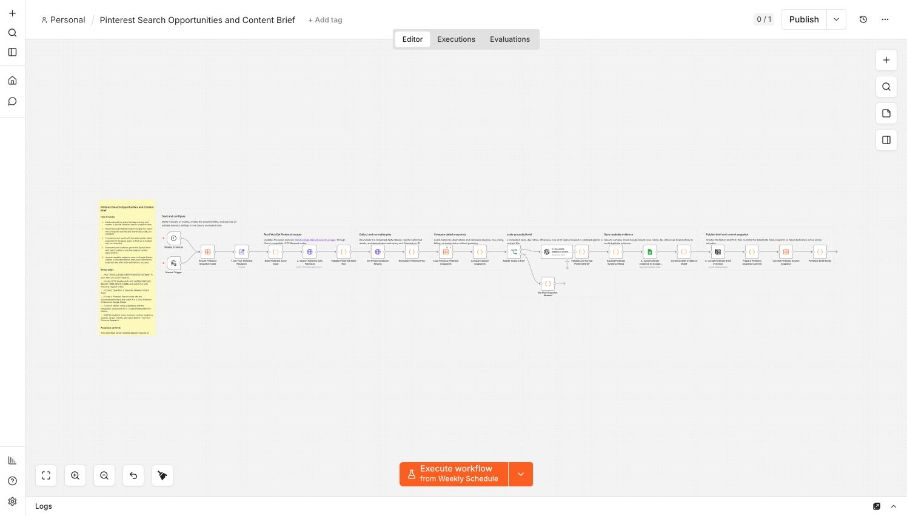

# Monitor Pinterest search opportunities and create weekly content briefs with FetchCat

Turn public Pinterest search results into an evidence-backed weekly content plan.
This workflow runs `fetch_cat/pinterest-search-scraper`, preserves dated rank
snapshots, compares each query with its latest earlier observation, saves the
source evidence to Google Sheets, and creates a structured Notion brief with
five original content opportunities.

It works on n8n Cloud or self-hosted n8n and uses only built-in HTTP Request,
Google Sheets, Notion, Data Table, Code, Schedule, and OpenAI nodes.

## Who is it for?

- Pinterest marketers and SEO teams researching public search results
- Ecommerce teams planning seasonal visual content
- Agencies producing repeatable research briefs for clients
- Bloggers and creators looking for evidence-backed topic and creative angles

## What it does

1. Runs manually or every Monday morning.
2. Searches one to five Pinterest queries with FetchCat Pinterest Search Scraper.
3. Creates a first-run baseline or compares results with the latest earlier snapshot.
4. Generates one strict, source-cited OpenAI analysis.
5. Upserts readable evidence rows to Google Sheets.
6. Creates a formatted Notion brief with observed patterns and content ideas.
7. Commits the snapshot only after both destinations succeed.

## Required accounts

- Apify with access to `fetch_cat/pinterest-search-scraper`
- OpenAI
- Google Sheets
- Notion

The workflow does not require Pinterest login or Pinterest Developer API access.
It does not publish pins or access private boards.

## Accuracy and cost controls

The first run never claims movement. Later movement is calculated from observed
search positions, not inferred by AI. Missing saves and repins remain unknown,
and the brief never invents search volume, clicks, or impressions. Same-day
retries are idempotent, and OpenAI analyzes all evidence in one structured batch.
