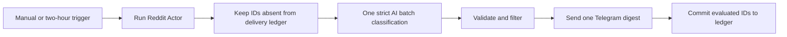

# Reddit Buying-Intent Alerts

Runs `fetch_cat/reddit-scraper` for a configurable search and optional
subreddit, checks a durable delivery ledger, classifies all new posts in one
strict structured AI call, and sends one Telegram digest containing
at most five qualified posts.

The workflow has a manual trigger and a two-hour schedule. It monitors only: it
never comments, replies, messages authors, or performs outreach.

## Setup

1. Install `@apify/n8n-nodes-apify@0.6.10` and import `workflow.json`.
2. Create `FetchCat Delivery Ledger` and `FetchCat Reddit Config` using the
   schemas below, then add one config row whose `configKey` is `default`.
3. Add Apify and OpenAI credentials to the processing nodes.
4. Create a Telegram group named `FetchCat n8n QA`, add a dedicated bot, and
   connect the bot credential in n8n.
5. Select that group's chat ID in `Send Telegram Digest`.
6. Import `../shared-error-notifications/workflow.json` and select it as this
   workflow's error workflow. Keep the schedule unpublished until QA passes.

Reddit config columns: `configKey`, `searchQuery`, `subreddit`, `sort`,
`timeFilter`, and `productContext` as strings; `minimumScore` and `maxItems` as
numbers. Ledger columns: `workflowSlug`, `itemKey`, and `destination` as
strings, plus `deliveredAt` as date/time. Start with global relevance search.

## Behavior

- Actor search sort and time window are configurable; defaults are global
  relevance over the past week, with comments disabled.
- No more than 10 posts reach one OpenAI batch request.
- Batch validation fails closed unless every input Reddit ID has exactly one
  result and there are no extras.
- Only `high` or `medium` buying intent above the threshold can pass.
- IDs are committed only after Telegram succeeds, so destination failures stay
  retryable.
- Alerts include subreddit, post age, Reddit score, comment count, summary,
  qualification reason, and a direct post link.
- Duplicate, empty, and below-threshold runs send no Telegram message.

## QA

Use no more than three Apify-backed runs: a happy path, an immediate duplicate
rerun, and a negative/empty query. Confirm the happy path sends at most one
message with five posts, and the duplicate and negative paths send nothing.
Then export, sanitize, reimport, and execute the sanitized workflow.

The fixtures are synthetic and do not represent real Reddit users or posts.
