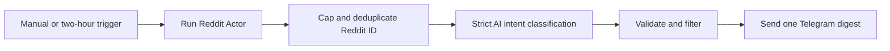

# Reddit Buying-Intent Alerts

Runs `fetch_cat/reddit-scraper` for a configurable search and optional
subreddit, removes posts seen in earlier executions, classifies explicit buying
intent with strict structured output, and sends one Telegram digest containing
at most five qualified posts.

The workflow has a manual trigger and a two-hour schedule. It monitors only: it
never comments, replies, messages authors, or performs outreach.

## Setup

1. Install `@apify/n8n-nodes-apify@0.6.10` and import `workflow.json`.
2. Add Apify and OpenAI credentials to the processing nodes.
3. Create a Telegram group named `FetchCat n8n QA`, add a dedicated bot, and
   connect the bot credential in n8n.
4. Select that group's chat ID in `Send Telegram Digest`.
5. Edit the `Configuration` node with the search query, optional subreddit,
   product context, and minimum score.
6. Keep the schedule unpublished until QA passes.

## Behavior

- Actor results are newest first, from the past day, with comments disabled.
- No more than 10 posts reach OpenAI.
- Up to 10,000 Reddit IDs are retained across prior executions.
- Only `high` or `medium` buying intent above the threshold can pass.
- Invalid structured output stops delivery.
- Duplicate, empty, and below-threshold runs send no Telegram message.

## QA

Use no more than three Apify-backed runs: a happy path, an immediate duplicate
rerun, and a negative/empty query. Confirm the happy path sends at most one
message with five posts, and the duplicate and negative paths send nothing.
Then export, sanitize, reimport, and execute the sanitized workflow.

The fixtures are synthetic and do not represent real Reddit users or posts.
