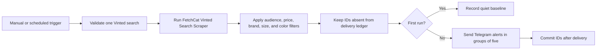

# Vinted New-Listing Alerts to Telegram

Runs the [FetchCat Vinted Search Scraper](https://apify.com/fetch_cat/vinted-search-scraper)
(`fetch_cat/vinted-search-scraper`) on a configurable schedule and sends only
previously unseen matching listings to Telegram. It supports audience, brand,
size, color-keyword, and price controls for buyers and
collectors who want to monitor one focused Vinted search without repeatedly
refreshing saved results.

The workflow defaults to one run per hour and 10 results. Users can change the
Schedule Trigger to run every 15 or 30 minutes, every 1, 6, or 12 hours, or once
per day. The result limit accepts 1 through 50. More frequent runs, more results,
or multiple copies of the workflow increase Apify usage.

It works on n8n Cloud or self-hosted n8n, uses only built-in n8n nodes, and does
not require OpenAI.

## Setup

1. Import `workflow.json` into n8n.
2. Open `1. Choose Alert Frequency`. Keep the hourly default or select an
   interval from 15 minutes through one day.
3. Open `2. Configure Vinted Search` and set:
   - `searchText`: the product, style, or model to find.
   - `audience`: `Any`, `Women`, `Men`, `Girls`, or `Boys`. The workflow adds
     this term to the Vinted search query.
   - `domain`: the relevant public marketplace, such as `www.vinted.fr`,
     `www.vinted.de`, or `www.vinted.co.uk`.
   - `minimumPrice` and `maximumPrice`: numeric price limits in the marketplace
     currency.
   - `allowedBrands`: optional comma-separated brand names, matched
     case-insensitively against Vinted's brand field. Without `brandIds`, each
     name also creates a focused Vinted search so matching brands are actually
     retrieved rather than filtered from an unrelated broad result page.
   - `allowedSizes`: optional comma-separated sizes. A value such as `M`, `38`,
     or `10` matches Vinted's combined size `M / 38 / 10`.
   - `allowedColors`: optional comma-separated color words matched against the
     listing title. Multiple values use OR logic and recognized colors appear
     in Telegram.
   - `requireColorInTitle`: off by default because Vinted sellers often omit
     colors from titles. Enable it only when listings without a recognized
     title color must be rejected.
   - `brandIds`: optional comma-separated numeric Vinted brand IDs for exact
     marketplace-side filtering.
   - `catalogIds`: optional comma-separated numeric Vinted catalog IDs. Use
     these when you need strict category or audience filtering.
   - `maxResults`: an integer from 1 to 50; the default is 10.
   - `sendFirstRunAlerts`: normally leave this off so setup creates a quiet
     baseline. Turn it on only when you intentionally want current results.

The included example monitors women's cycling jerseys up to EUR 150 from MAAP
and Pas Normal Studios in sizes S or XS. Since its default marketplace is `www.vinted.fr`, the
color list includes English and French terms such as `black, noir` and
`yellow, jaune`. Replace these examples with words used by sellers in your
selected marketplace.

Brand-name searches divide `maxResults` across the configured names and require
one Actor run per name. For example, 10 results across three names requests up
to four listings from each search and caps the combined output at 10. Numeric
`brandIds` are more efficient because Vinted can apply several IDs in one Actor
run.
4. Create an HTTP Header Auth credential with header `Authorization` and value
   `Bearer YOUR_APIFY_TOKEN`. Select it in both Apify HTTP Request nodes.
5. Connect a Telegram Bot credential in `4. Send New Listings to Telegram` and
   enter the private chat or group ID that should receive alerts.
6. Run the workflow manually. With the safe default, the first successful run
   records current listing IDs without sending a message.
7. Run it again to verify that unchanged listings do not send duplicate alerts,
   then activate the schedule.

## Behavior

- Search state is scoped to the complete configuration. Changing the domain,
  query, audience, price range, or any allowlist creates a new baseline.
- Telegram messages contain title, price, brand, size, condition, seller,
  engagement counters when available, and a direct listing link.
- Listings are grouped five per message to stay readable and within Telegram's
  message limits.
- IDs are written to `FetchCat Delivery Ledger` only after Telegram succeeds.
  A Telegram failure therefore leaves those listings retryable.
- `FetchCat Vinted Monitor State` records whether a search configuration has
  completed its baseline.
- Empty searches and fully delivered reruns create no Telegram messages.
- A valid search with zero filtered matches ends at `No Listings Match Your
  Filters` and reports the likely blocking filter, stage counts, returned
  brands and sizes, and a suggested next step.
- The workflow never buys an item, contacts a seller, or signs into Vinted.

## Cost Guidance

The Actor currently charges a run-start event plus each listing saved. At the
published Free-tier event prices, one hourly search returning 10 listings is
approximately USD 7.78 per 30-day month. Every 30 minutes is approximately USD
15.55 and every 15 minutes approximately USD 31.10. These are estimates, not a
guarantee; check the Actor page for current pricing before activation.

n8n Cloud also counts every scheduled workflow run as an execution, even when
there are no new listings. Hourly uses about 720 executions per 30-day month;
every 30 minutes uses about 1,440; every 15 minutes uses about 2,880.

## Limitations

- Vinted does not expose an authoritative listing creation timestamp through
  this Actor. "New" means that the listing ID was not present in a previous
  successful workflow run.
- A result limit that is lower than the number of listings added between runs
  can miss older additions that fall outside the newest returned page.
- Audience terms improve Vinted search relevance, but exact audience/category
  filtering requires the optional Vinted `catalogIds` field.
- Brand names use Vinted's structured brand field. Sizes use its structured
  size field with token-aware matching. Color is not returned as structured
  metadata by this Actor, so recognized colors come from whole words in titles.
  Strict color filtering is optional and can omit listings whose sellers did
  not name the visible color.
- The Actor returns and charges for dataset rows before n8n removes previously
  delivered IDs.
- Each configured brand name creates one Actor run unless numeric `brandIds`
  are supplied. More brand names therefore increase run-start charges.

## QA

Use at most three Apify-backed executions: first-run baseline, one controlled
delivery, and one duplicate rerun. Confirm that the first run is quiet by
default, Telegram receives readable links, a duplicate rerun sends nothing,
and a failed Telegram call does not commit IDs.

Synthetic Actor-shaped input and deterministic assertions are stored under
`fixtures/`. They contain no real listings or personal information.
