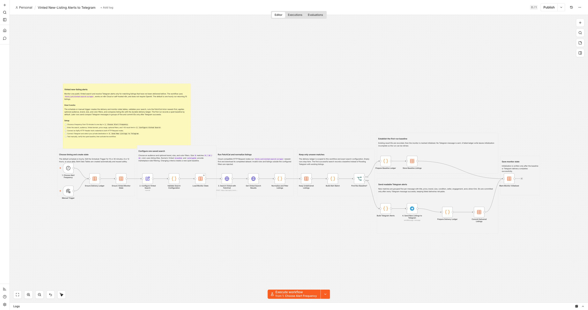
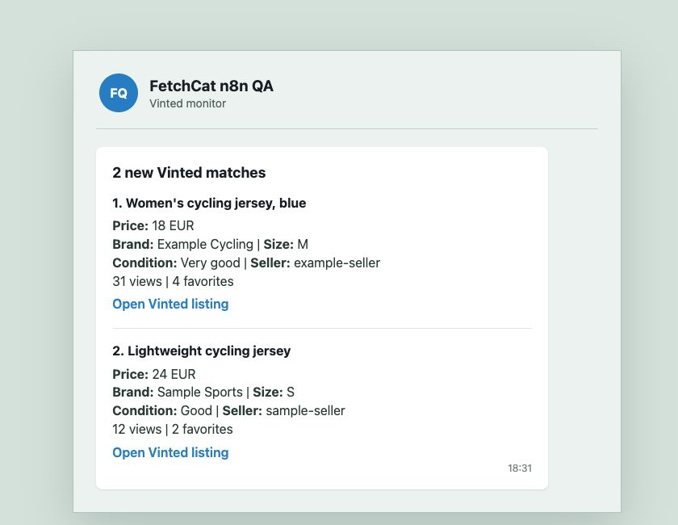

Monitor one focused Vinted search and receive Telegram alerts when previously
unseen matching listings appear. This workflow runs
`fetch_cat/vinted-search-scraper` newest-first, applies audience, price, brand,
size, and color-keyword filters, and uses n8n Data Tables to prevent duplicate
notifications.

The default schedule is hourly with 10 results per run. You can configure the
Schedule Trigger from every 15 minutes through once per day and choose between
1 and 50 results. The first successful run quietly records a baseline so the
workflow does not flood Telegram with existing listings.

The editable example is prefilled for women's cycling jerseys from MAAP and
Pas Normal Studios in sizes S or XS, with bilingual color keywords suitable for
the default French marketplace.

## Who is it for?

- Buyers looking for a specific model, brand, size, or collectible
- People who miss good listings because they sell before the next manual check
- Resellers who need monitoring and alerts without automated purchasing

## How it works

1. Runs manually or on the schedule you select.
2. Validates the Vinted domain, search, audience, price range, filters, and result limit.
3. Runs the FetchCat Vinted Search Scraper through Cloud-compatible HTTP nodes.
4. Filters malformed and nonmatching results.
5. Explains which filter blocked the run when no listing matches.
6. Checks each listing ID against a durable delivery ledger.
7. Records a quiet baseline on the first run.
8. Sends new matches to Telegram in readable groups of five.
9. Commits listing IDs only after Telegram succeeds.

## Setup

Connect an Apify HTTP Header Auth credential and a Telegram Bot credential.
Choose the Telegram destination, edit the search configuration, run once
manually, and activate the schedule after checking the baseline. The workflow
works on n8n Cloud or self-hosted n8n and does not use an AI model.

## Important cost note

Apify charges for the run and returned listings, while n8n Cloud counts every
scheduled execution. The hourly 10-result default is the recommended balanced
starting point. Faster schedules and larger result limits cost more.

The workflow only monitors public listings. It never purchases items, contacts
sellers, signs into Vinted, or claims that a listing is still available.
