# YouTube Research Brief to Notion

Accepts one public YouTube URL, language code, and research goal through an n8n
Form. `fetch_cat/youtube-transcript-scraper` retrieves captions for exactly one
video. OpenAI turns the capped transcript into a strict research brief, and the
workflow creates a page in a dedicated Notion database before redirecting the
form response to that page.

## Setup

1. Install `@apify/n8n-nodes-apify@0.6.10` and import `workflow.json`.
2. Add Apify and OpenAI credentials to the processing nodes.
3. Create a Notion database named `FetchCat n8n QA Briefs`, share it with the
   selected Notion integration, and select it in `Create Notion Brief`.
4. The workflow creates `FetchCat Delivery Ledger` automatically on first use.
5. Optionally import `../shared-error-notifications/workflow.json` and select it as this
   workflow's error workflow.
6. Keep the workflow unpublished during QA and use the form's test URL.

The form accepts only HTTPS URLs on YouTube hosts. Language must be a short code,
and the research goal must contain 10 to 1,000 characters.

## Behavior

```mermaid
flowchart LR
  F[Research form] --> V[Validate URL and goal]
  V --> I[Create or reuse delivery ledger]
  I --> A[Run transcript Actor]
  A --> C[Require captions and cap text]
  C --> D[Keep request absent from delivery ledger]
  D --> O[Strict AI research brief]
  O --> N[Create Notion page]
  N --> L[Commit request to ledger]
  L --> R[Return page URL]
```

- The Actor receives one URL and `maxVideos: 1`.
- Missing or unavailable captions stop the workflow before OpenAI and Notion.
- Timestamped caption segments are preserved as `[mm:ss]` transcript lines and
  capped at 60,000 characters before AI processing.
- Delivered video and research-goal reruns stop before OpenAI and Notion. The
  request is committed only after Notion succeeds, so failed writes are retryable.
- Output must contain `summary`, `keyIdeas`, `actionItems`, and at least three
  `timestampedMoments` copied from timestamps present in the transcript.
- Notion renders Research goal, Summary, Key ideas, Action items, and
  Timestamped moments as real headings with paragraph and list blocks.
- Notion writes only to the selected database. The returned page URL must use
  HTTPS or the workflow fails.

## QA

Run one captioned video, one exact duplicate execution, and one
unavailable-caption or invalid-input case. The duplicate must create no second
page and must not call OpenAI. The negative case must create no Notion page and
must not call OpenAI when captions are absent.

After QA, export, sanitize, reimport, and execute the sanitized graph. Store
execution IDs and private output evidence outside this repository.
