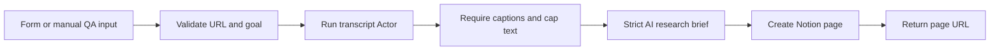

# YouTube Research Brief to Notion

Accepts one public YouTube URL, language code, and research goal through an n8n
Form. `fetch_cat/youtube-transcript-scraper` retrieves captions for exactly one
video. OpenAI turns the capped transcript into a strict research brief, and the
workflow creates a page in a dedicated Notion database before redirecting the
form response to that page.

A separate manual QA path allows supported `n8n execute --id` testing while the
form and workflow remain unpublished.

## Setup

1. Install `@apify/n8n-nodes-apify@0.6.10` and import `workflow.json`.
2. Add Apify and OpenAI credentials to the processing nodes.
3. Create a Notion database named `FetchCat n8n QA Briefs`, share it with the
   selected Notion integration, and select it in `Create Notion Brief`.
4. Confirm or replace the captioned public video in `Manual QA Input` before a
   CLI execution.
5. Keep the workflow unpublished. Use the form's test URL for form-specific QA.

The form accepts only HTTPS URLs on YouTube hosts. Language must be a short code,
and the research goal must contain 10 to 1,000 characters.

## Behavior

- The Actor receives one URL and `maxVideos: 1`.
- Missing or unavailable captions stop the workflow before OpenAI and Notion.
- Transcript input is capped at 60,000 characters before AI processing.
- Exact video and research-goal reruns are deduplicated before OpenAI and Notion.
- Output must contain `summary`, `keyIdeas`, `actionItems`, and validated
  `timestampedMoments`.
- Notion writes only to the selected database. The returned page URL must use
  HTTPS or the workflow fails.

## QA

Run one captioned video, one exact duplicate execution, and one
unavailable-caption or invalid-input case. The duplicate must create no second
page and must not call OpenAI. The negative case must create no Notion page and
must not call OpenAI when captions are absent.

After QA, export, sanitize, reimport, and execute the sanitized graph. Store
execution IDs and private output evidence outside this repository.
